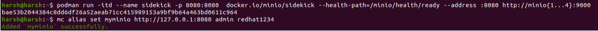

  <center> <u> <h1 style="font-size: 50px;">MinIO Setup
</h1> </u> </center>
  

## 1. Task requirement

To set up an object storage system in a cluster using MinIO.

## 2. Environment details

- OS: Ubuntu 20.04

## 3. List of tools and technologies

- **MinIO** - Latest Version (RELEASE.2023-08-16T20-17-30Z)

## 4. Definition of tools

- MinIO - It is a software-defined high performance distributed object storage server. You can run MinIO on consumer or enterprise-grade hardware and a variety of operating systems and architectures.
  
#### Architecture Diagram


## 5.Command for the setup or configuration**

**Node1:**

```bash
docker run -itd --name minio1 --net=host -e MINIO_ROOT_PASSWORD=redhat1234 -e MINIO_ROOT_USER=admin   -p 9000:9000 -p 9090:9090 -v /mnt/disk1:/data docker.io/minio/minio minio server --console-address ":9090" http://minio{1..4}/data
```


**Node2:**

```bash
docker run -itd --name minio2 --net=host -e MINIO_ROOT_PASSWORD=redhat1234 -e MINIO_ROOT_USER=admin   -p 9000:9000 -p 9090:9090 -v /mnt/disk2:/data docker.io/minio/minio minio server --console-address ":9090" http://minio{1..4}/data

```


**Node3:**

```bash
 docker run -itd --name minio3 --net=host -e MINIO_ROOT_PASSWORD=redhat1234 -e MINIO_ROOT_USER=admin   -p 9000:9000 -p 9090:9090 -v /mnt/disk3:/data docker.io/minio/minio minio server --console-address ":9090" http://minio{1..4}/data
```


**Node4:**

```bash
docker run -itd --name minio4 --net=host -e MINIO_ROOT_PASSWORD=redhat1234 -e MINIO_ROOT_USER=admin   -p 9000:9000 -p 9090:9090 -v /mnt/disk4:/data docker.io/minio/minio minio server --console-address ":9090" http://minio{1..4}/data
```


- **docker run**: This is the command used to create and start a new Docker container.

- **itd:** These are flags that determine how the container is run:
    - **(i)** : This flag tells the container to keep the standard input (stdin) open. It's commonly used when you want to interact with the container, like running an interactive shell inside it.
      
    - **(t)** : This flag allocates a pseudo-TTY (terminal) for the container. It simulates a terminal environment, which is useful for running commands that require terminal-like behavior, such as command-line prompts.
      
    - **(d)** : Run the container in detached mode (background).

- **-name minio1**: This assigns the name "minio1" to the Docker container.

- **-net=host**: This configures the container to share the host network namespace. It allows the container to use the host's network stack, which might be necessary for specific networking configurations.

- **e MINIO_ROOT_PASSWORD=redhat1234**: This sets the environment variable **MINIO_ROOT_PASSWORD** with the value "redhat1234". MinIO uses this password to secure the root user's access.

- **e MINIO_ROOT_USER=admin**: This sets the environment variable **MINIO_ROOT_USER** with the value "admin". This specifies the root user's username.

- **p 9000:9000 -p 9090:9090**: These options map ports between the host and the container:
    - **p 9000:9000**: Map port 9000 on the host to port 9000 in the container. This is the default port for MinIO operations.
    - **p 9090:9090**: Map port 9090 on the host to port 9090 in the container. This is used for the MinIO console.

- **-v /mnt/disk1:/data**: This mounts the directory **/mnt/disk1** on the host to the **/data** directory within the container. This can be used to persistently store MinIO data.

- **docker.io/minio/minio**: This specifies the Docker image to use, which is the official MinIO server image from Docker Hub.

- **minio server --console-address ":9090" http://minio{1..4}/data:** This is the command that is passed to the MinIO server when it starts in the container

- **-console-address ":9090"**: This specifies that the MinIO console should listen on port 9090.

- **http://minio{1..4}/data**: This seems to be indicating a distributed setup with multiple MinIO instances (minio1, minio2, minio3, minio4) and using **/data** as the data directory.


**Sidekick** constantly monitors the MinIO servers for availability using the readiness service API. For legacy applications, it will fallback to port-reachability for readiness checks.If any of the MinIO servers go down, Sidekick will automatically reroute the S3 requests to other servers until the failed server comes back online.


Add the below commands for sidekick MiniIO.


**Do host entry of minio1,minio2,minio3,minio4**

```bash
  podman run -itd --name sidekick -p 8080:8080  [docker.io/minio/sidekick](http://docker.io/minio/sidekick)--health-path=/minio/health/ready --address :8080 [http://minio](http://minio/){1...4}:9000
```


- **-name sidekick**: This assigns the name "sidekick" to the container.

- **p 8080:8080**: This maps port 8080 on the host to port 8080 in the container. It allows you to access the sidekick's web interface.

- **docker.io/minio/sidekick**: This specifies the Docker image to use, which is the official MinIO Sidekick image from Docker Hub.

- **-health-path=/minio/health/ready**: This specifies the health check endpoint path that the MinIO Sidekick will use to monitor the MinIO instances' readiness.

- -**address :8080**: This specifies that the MinIO Sidekick's web interface should listen on port 8080.
  
    


Here first, we have to download mc command on client machine and  then we have to set alias for them,

- **aliases** in the MinIO Client (**mc**) provide a way to simplify and streamline interactions with multiple MinIO servers, making it more convenient to manage and perform actions on different storage endpoints.


- The [**mc alias**](https://min.io/docs/minio/linux/reference/minio-mc/mc-alias.html#command-mc.alias) commands provide a convenient interface for managing the list of S3-compatible hosts that **[mc](https://min.io/docs/minio/linux/reference/minio-mc.html#command-mc)** can connect to and run operations against.


```bash
curl https://dl.min.io/client/mc/release/linux-amd64/mc --create-dirs -o $HOME/minio-binaries/m

chmod +x $HOME/minio-binaries/mc

export PATH=$PATH:$HOME/minio-binaries/
```


- **curl**: The command-line tool used to make HTTP requests.

- **https://dl.min.io/client/mc/release/linux-amd64/mc**: The URL from which to download the MinIO client binary for the Linux AMD64 architecture.

- **-create-dirs**: This flag tells **curl** to create the necessary directory structure if it doesn't exist. In this case, it's used to create the directory **$HOME/minio-binaries/** if it doesn't already exist.

- **HOME/minio-binaries/mc**: This flag specifies the output file path and name for the downloaded binary. In this case, it's being saved as **mc** in the **HOME/minio-binaries/** directory.

- **(+x)** flag adds execute permissions to the file

- **export PATH=PATH:HOME/minio-binaries**/ This command adds the directory containing the MinIO client binary to the system's **PATH** environment variable. The **PATH** is a list of directories where the shell looks for executable files. By adding the MinIO binaries directory to the **PATH,** we can run the **mc** command from any location in the terminal without specifying the full path to the executable.

**To check the bucket and object in the bucket.**


**To check the metrics of sidekick.**

```bash
harsh@harsh:~$ curl -v localhost:8080/.prometheus/metrics
```

- **(v)**: This flag stands for "verbose." When used with **curl**, it makes the tool provide more detailed information about the request and response..

- **localhost:8080**: This is the hostname and port number of the target server. In this case, you are making the request to the local machine (localhost) on port 8080.

- **/.prometheus/metrics**: This is the path of the URL we are requesting. It indicates that we want to access the Prometheus metrics endpoint provided by a service running on port 8080.

- Prometheus is a monitoring and alerting toolkit often used for collecting and analyzing metrics from various services.

## 6. TEST CASES LIST ##

| S.NO | Component/Tool Name | Test case | Test count | Test cases | Expected Result | Test Passed[PASS/FAIL] | Remarks |
|----------|----------|----------|----------|----------|----------|----------|----------|

**Note** :NA


## Screen with pass test cases result ##


**Note** :NA

## 7. REFERENCE LINK

- [https://github.com/minio/sidekick](https://github.com/minio/sidekick)

</aside>
